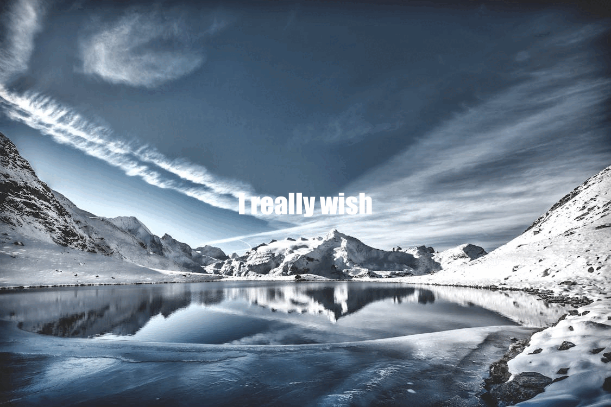

# Stat220-Project3
---
title: "Project 3"
author: "Ganesh Digamarthi"
subtitle: "STATS 220 Semester One 2025"
output: 
  html_document:
    code_folding: hide
---

```{r setup, include=FALSE}
knitr::opts_chunk$set(echo=TRUE, message=FALSE, warning=FALSE, error=FALSE)
library(tidyverse)
selected_photos <- read_csv("selected_photos.csv")

```

```{css}
/* Add CSS to change the appearance of your report */
h1 {
  font-family: 'Arial', sans-serif;
  color: #ff0;
  background-color: #ccc;
  
}

body {
color: #0ff
background-color: #000
}
```

## Introduction

The words I used on pexel.com are "Snowy Mountains" because I used to live in New Plymouth and see the snow filled Mt Taranaki everyday in winter and I just felt a little nostalgic.

[My Pexel search](https://www.pexels.com/search/snowy%20mountains/)


Most of the photos are landscape probably because they are all high quality pictures taken from good camera equipment. 

They are mostly blue and white the colors of snow and the sky some posts were also white and pink and white and orange capturing the sunset by the mountains.

The likes on these posts vary a lot some are at 5k and some are on 0 likes but this doesn't seem to correlate to how good the photos are as some really nice and well shot pictures are at 5-10 likes but most of those nicer pictures are the ones to get a lot of the attention.

```{r}
selected_photos %>%
  select(url) %>%
  knitr::kable()
```

## Key features of my selected photos
```{r}
# Calculate summary statistics
avg_width <- mean(selected_photos$width)
avg_height <- mean(selected_photos$height)
avg_color <- mean(selected_photos$colorfulness)
avg_aspect <- mean(selected_photos$aspect_ratio)
```

The selected photos have an average width of `r mean(selected_photos$width)` pixels, providing high-quality photographs even though they are considered to be a little too big for online/social media use.

However combining the average width of `r mean(selected_photos$width)` pixels with the average height of `r mean(selected_photos$height)` pixels of resolution is very good for high quality displays which was most of the posts that are in selected_photos and also for printing as well.

I calculated the average color by it's darkness, 1 being the picture is very dark and 0 being the picture is super light. The average came to `r mean(selected_photos$colorfulness)` which is very reasonable as most of the photos are white and blue giving the lighter and colorfulness feel. 

The median aspect ratio of `r round(avg_aspect, 2)` indicates most photos are `r ifelse(avg_aspect > 1.3, "landscape-oriented", ifelse(avg_aspect < 0.8, "portrait-oriented", "nearly square"))`.


## Creativity


My project displays creativity in how I improved my skills in combing R functions and understanding why how certain codes don't work which made me adapt and get better as time passes. Also the fact that I'm getting more comfortable and better with this and doing my own research and asking for help when i need it as I was struggling with this in the past.  

## Learning reflection
One thing I learnt from module 3 is data sourcing from API. This is completely new to me and I struggled with this on Project 3 the most. Also getting used to and being better at using the ifelse(), fromJSON() and pull() functions as I've used them this project but are in the labs. I'm looking forward to what we can do with JSON and more fun ways to process and analyse data. 


## Appendix
```{r file='exploration.R', eval=FALSE, echo=TRUE}

```
```{r file='project3_report.Rmd', eval=FALSE, echo=TRUE}

```
